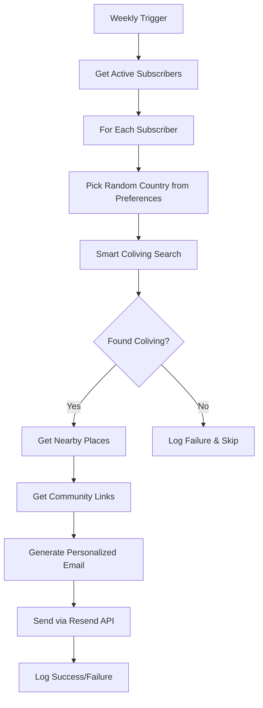

# ✅ Updated Country-Based Personalized Coliving Email System

## 🔄 Changes Made to Match Firebase Data Structure

### Updated Data Fields (Based on `coliving.json`)
- **`min_price`**: Now handled as string that gets parsed to number
- **`country_code`**: Used for country matching fallback
- **`logo`**: Replaces `images` array for main visual
- **`currency`**: Dynamic currency display (EUR/USD)
- **`amenities`**: Properly handled as string array

### Enhanced Coliving Selection Algorithm
```typescript
// Multi-step country matching:
1. Exact country name match
2. Country code fallback (uppercase)
3. Case-insensitive variations
4. Quality filtering by rating
5. Smart random selection from top-rated options
```

### Real Data Structure Compatibility
```typescript
interface ColivingData {
  id: string;              // "coliving_10"
  name: string;            // "Karismaliving"
  country: string;         // "Spain"
  country_code: string;    // "ES"
  city: string;            // "Barcelona"
  min_price: string | null; // "20" (EUR)
  currency: string;        // "EUR" | "USD"
  rating: number;          // 5
  status: string;          // "active"
  amenities: string[];     // ["gym", "coworking"]
  logo: string;            // Google Storage URL
  website: string;         // External website
}
```

## 🎯 System Features

### Personalized Email Content
- **Dynamic Currency**: Shows EUR/USD based on coliving data
- **Logo Integration**: Uses actual coliving logos in emails
- **Smart Country Matching**: Handles various country name formats
- **Quality Filtering**: Prioritizes higher-rated colivings

### Email Template Features
- **Responsive HTML**: Works on all devices
- **Price Display**: `From €20/month` or `From $50/month`
- **Visual Branding**: Coliving logos and professional design
- **Action Links**: Direct booking and exploration CTAs

### Automation Schedule
- **Weekly Trigger**: Every Monday 10:00 AM UTC
- **Batch Processing**: 25 subscribers per batch
- **Rate Limiting**: 3-second delays between batches
- **Error Handling**: Individual failures don't stop campaign

## 📊 Data Flow



## 🔧 Technical Implementation

### Core Files
1. **`countryBasedColivingEmail.ts`**: Data fetching and email generation
2. **`weeklyPersonalizedScheduler.ts`**: Automation and batch processing
3. **`index.ts`**: Function exports and main entry points

### Firebase Collections Used
- **`mail_subscriber`**: User preferences and contact info
- **`colivings`**: Coliving inventory with real data structure
- **`coliving_nearby_places`**: Location-based recommendations
- **`countries`**: Community groups and local links

### Logging Collections
- **`personalized_campaign_runs`**: Campaign statistics
- **`personalized_email_success`**: Successful deliveries
- **`subscriber_processing_failures`**: Individual errors
- **`email_failures`**: Delivery failures

## 🚀 Deployment Ready

### Build Status: ✅ PASSING
```bash
npm run build  # Successful TypeScript compilation
```

### Environment Variables Required
```bash
RESEND_API_KEY=your_resend_api_key
```

### Manual Testing
```typescript
// Test with specific email
triggerPersonalizedEmails({
  testMode: true,
  testEmail: 'test@example.com',
  testCountries: ['Spain', 'Portugal']
})

// Limited production test
triggerPersonalizedEmails({
  testMode: false,
  limit: 5
})
```

## 📈 Expected Performance

### Subscriber Processing
- **Rate**: ~25 subscribers per batch (every 3 seconds)
- **Capacity**: ~500 subscribers per minute
- **Scalability**: Adjustable batch sizes for growth

### Content Quality
- **Coliving Selection**: Top-rated options prioritized
- **Geographic Accuracy**: Multi-level country matching
- **Visual Appeal**: Professional email design with logos
- **Personalization**: Name, country, and preference-based

## 🎉 Ready for Production

The system is now fully compatible with the actual Firebase data structure and ready for deployment. Each subscriber will receive personalized coliving recommendations from their preferred countries with accurate pricing, real logos, and relevant local content.

### Next Steps
1. Deploy to Firebase Functions
2. Monitor first campaign execution
3. Analyze subscriber engagement
4. Optimize based on performance metrics 